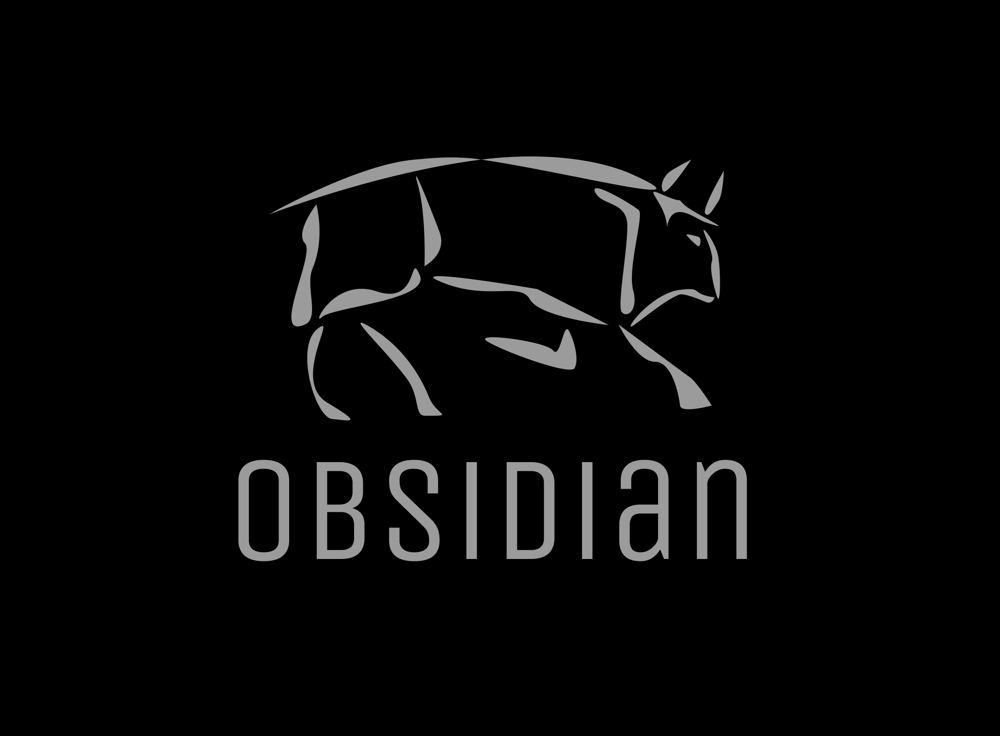

<div align="center">GraphQL, built for Deno.</div>

<div align="center">

<h1 align="center">
	<a>Obsidian</a>
	<a href="https://twitter.com/intent/tweet?text=Meet%20Obsidian!%20Deno's%20first%20native%20GraphQL%20caching%20client%20and%20server%20module&url=http://obsidian.land/&via=obsidian_land&hashtags=deno,denoland,nodejs,graphql,javascript" rel="nofollow"></a>
</h1>

<p align="center">from <em align="center">Lascaux</em></p>

</div>

<p align="center">
  
  
  
    
</p>

## Features

- GraphQL query abstraction and caching improving the performance of your app
- SSR React wrapper, allowing you to cache in browser
- Configurable caching options, giving you complete control over your cache
- Fullstack integration, leveraging client-side and server-side caching to streamline your caching strategy
- Support for the full GraphQL convention
- Support for client-side and server-side cache invalidation
- Optional GraphQL DoS attack mitigation security module

## Overview

Obsidian is Deno's first native GraphQL caching client and server module. Boasting lightning-fast caching and fetching capabilities alongside headlining normalization and rebuilding strategies, Obsidian is equipped to support scalable, highly performant applications.

With additional support for use in server-side rendered React apps built with Deno, full stack integration of Obsidian enables a fast and flexible caching solution.


## Installation

<div align="center"><strong>QUICK START</strong></div>
<br>

## Creating the Router

```javascript
import { Application, Router } from 'https://deno.land/x/oak@v6.0.1/mod.ts';
import { ObsidianRouter, gql } from 'https://deno.land/x/obsidian/mod.ts';
import { resolvers } from './ import from your resolvers file'
import { types } from './ import your schema/types from schema/types file'


interface ObsRouter extends Router {
  obsidianSchema?: any;
}

const GraphQLRouter = await ObsidianRouter<ObsRouter>({
  Router,
  typeDefs: types,
  resolvers: resolvers,   
  redisPort: 6379,        //Desired redis port
  useCache: true,         //Boolean to toggle all cache functionality
  usePlayground: true,    //Boolean to allow for graphQL playground
  useQueryCache: true,    //Boolean to toogle full query cache
  useRebuildCache: true,  //Boolean to toggle rebuilding from normalized data
  customIdentifier: ["id", "__typename"]  
        
});

// attach the graphql routers routes to our app
  app.use(GraphQLRouter.routes(), GraphQLRouter.allowedMethods());
```

## Creating the Wrapper

```javascript
import { ObsidianWrapper } from 'https://deno.land/x/obsidian/clientMod.ts';

const App = () => {
  return (
    <ObsidianWrapper>
      <MovieApp />
    </ObsidianWrapper>
  );
};
```

## Making a Query

```javascript
import { useObsidian, BrowserCache } from 'https://deno.land/x/obsidian/clientMod.ts';

const MovieApp = () => {
  const { query, cache, setCache } = useObsidian();
  const [movies, setMovies] = (React as any).useState('');

  const queryStr = `query {
      movies {
        id
        title
        releaseYear
        genre
      }
    }
  `;

  return (
    <h1>{movies}</h1>
    <button
      onClick={() => {
        query(queryStr)
        .then(resp => setMovies(resp.data))
        .then(resp => setCache(new BrowserCache(cache.storage)))
      }}
    >Get Movies</button>
  );
};
```

## Making a Mutation

```javascript
import { useObsidian, BrowserCache } from 'https://deno.land/x/obsidian/clientMod.ts';

const MovieApp = () => {
  const { mutate, cache, setCache } = useObsidian();
  const [movies, setMovies] = (React as any).useState('');

  const queryStr = `mutation {
    addMovie(input: {title: "Cruel Intentions", releaseYear: 1999, genre: "DRAMA" }) {
      id
      title
      releaseYear
      genre
    }
  }
  `;

  return (
    <h1>{movies}</h1>
    <button
      onClick={() => {
        mutate(queryStr)
        .then(resp => setMovies(resp.data))
        .then(resp => setCache(new BrowserCache(cache.storage)))
      }}
    >Get Movies</button>
  );
}
```

## Documentation
[obsidian.land](http://obsidian.land)

## Developer Tool
information and instructions on how to use our developer tool can be found here <br/>
works with Obsidian 5.0 <br/>
[oslabs-beta/obsidian-developer-tool](https://github.com/oslabs-beta/obsidian-developer-tool)

## Obsidian 5.0 Demo
github for a demo with some example code to play with: <br/>
[oslabs-beta/obsidian-demo-5.0](https://github.com/oslabs-beta/obsidian-demo-5.0)

## Dockerized Demo
working demo to install locally in docker:    
[oslabs-beta/obsidian-demo-docker](https://github.com/oslabs-beta/obsidian-demo-docker)

## Working Example Demo Code
github for a demo with some example code to play with:    
[oslabs-beta/obsidian-demo-3.2](https://github.com/oslabs-beta/obsidian-demo-3.2)


## Authors
[Yurii Shchyrba](https://github.com/YuriiShchyrba)   
[Linda Zhao](https://github.com/lzhao15)   
[Ali Fay](https://github.com/ali-fay)   
[Anthony Guan](https://github.com/guananthony)   
[Yasir Choudhury](https://github.com/Yasir-Choudhury)   
[Yogi Paturu](https://github.com/YogiPaturu)   
[Michael Chin](https://github.com/mikechin37)   
[Dana Flury](https://github.com/dmflury)   
[Sardor Akhmedov](https://github.com/sarkamedo)   
[Christopher Berry](https://github.com/cjamesb)   
[Olivia Yeghiazarian](https://github.com/Olivia-code)  
[Michael Melville](https://github.com/meekle)   
[John Wong](https://github.com/johnwongfc)    
[Kyung Lee](https://github.com/kyunglee1)   
[Justin McKay](https://github.com/justinwmckay)   
[Patrick Sullivan](https://github.com/pjmsullivan)  
[Cameron Simmons](https://github.com/cssim22)  
[Raymond Ahn](https://github.com/raymondcodes)  
[Alonso Garza](https://github.com/Alonsog66)   
[Burak Caliskan](https://github.com/CaliskanBurak)  
[Matt Meigs](https://github.com/mmeigs)  
[Travis Frank](https://github.com/TravisFrankMTG/)  
[Lourent Flores](https://github.com/lourentflores)  
[Esma Sahraoui](https://github.com/EsmaShr)  
[Derek Miller](https://github.com/dsymiller)  
[Eric Marcatoma](https://github.com/ericmarc159)  
[Spencer Stockton](https://github.com/tonstock)  
